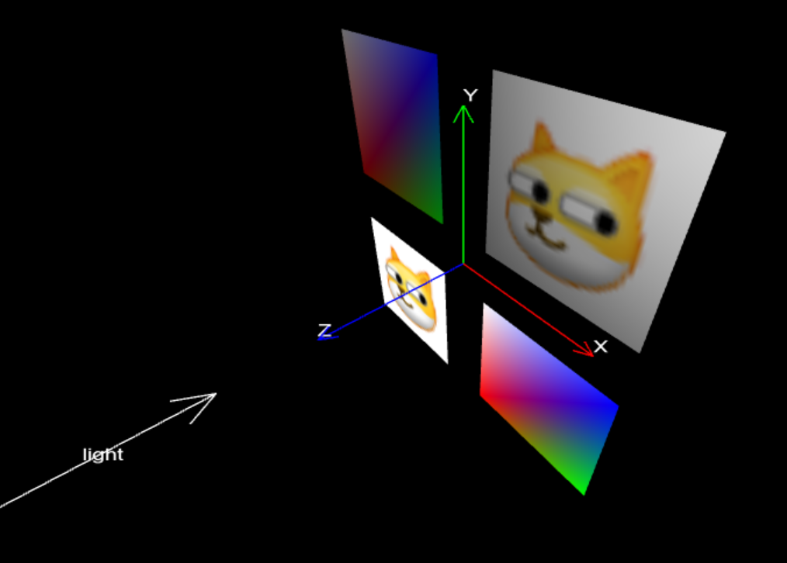

# TG 3D 渲染引擎

## 简介

TG 3D 渲染引擎是一个基于 WebGL 的 3D 图形渲染库。它提供了一套简单的 API，用于在网页上创建和操作 3D 图形内容。

- 摄像机控制：支持透视和正交投影，方便地设置摄像机位置和视角。
- 灯光和纹理：支持简单的光照模型，支持将2D纹理应用到物体表面。
- 动态截图和录制：提供了截图和录制画面的功能。

依赖：gl-matrix库

## 快速开始

下载代码，并用 live server 运行 `demo.html`。Demo 效果如图



## API文档

### 初始化

在使用TG图形库之前，需要首先获取画布元素并初始化TG对象。

```javascript
var canvas = document.getElementById('canvas');
var tg = new TG(canvas);
```

### 相机设置 (`setCamera`)

设置相机的参数来定义视图。

- **position**: 相机位置坐标，类型为`vec3`。
- **target**: 相机目标点，类型为`vec3`。
- **mode**: 相机模式，可选值为 `"orthographic"`（正交）或 `"perspective"`（透视）。
- **fov**: 视角（仅在透视模式下有效），单位为度。
- **near**: 近裁剪面。
- **far**: 远裁剪面。

### 变换操作

TG 提供了一系列类似于 glut 的变换操作函数，包括`pushModelMatrix`、`popModelMatrix`、`translate`、`rotate`、`rotateX`、`rotateY`、`rotateZ`、`scale`等。

```javascript
tg.pushModelMatrix();
{
    tg.rotate(frame / 100, 0, 1, 0);
    tg.translate(0.5, 0, 0);
    var scalef = 1 + 0.9 * Math.cos(frame / 80);
    tg.scale(scalef, scalef, scalef);
    tg.drawXYZ();
}
tg.popModelMatrix();
```

### 光照设置 (`setLight`)

设置光照，目前仅支持平行光。

- **lightDir**: 光照方向，类型为三维向量`[x, y, z]`。
- **lightColor**: 光照颜色，类型为三维向量`[r, g, b]`，每个分量的取值范围为0到1。

### 简单绘图函数

#### `drawLine`

画线。

- **start**: 线段起点，格式为`[x, y, z]`。
- **end**: 线段终点，格式为`[x, y, z]`。
- **color**: 线段颜色，格式为`[r, g, b]`。

#### `drawArrow`

画箭头，参数同`drawLine`。

#### `drawLine2D`

绘制2D直线，参数同`drawLine`，但不受模型变换影响。

#### `drawXYZ`

画坐标轴。

#### `drawText`

绘制文本。

- **text**: 文本内容。
- **position**: 文本左下角坐标。
- **fontColor**: 文本颜色，如`"#ffffff"`表示白色。
- **renderHeight**: 渲染高度。
- **scale**: 渲染精度，值越高性能开销越大。

```javascript
tg.drawText("Hallo World", [-0.5, 0.5, 0], "#ffffff", 0.05, 1);
```

#### `drawColorFaces`

绘制彩色面。

- **vertices**: 顶点数组，定义了面的形状。
- **colors**: 颜色数组，为每个顶点指定颜色。
- **indices**: 索引数组，指定构成面的顶点序列。

```javascript
var vertices = [
    0.0, 0.0, 0.0,  // 顶点0
    1.0, 0.0, 0.0,  // 顶点1
    1.0, 1.0, 0.0,  // 顶点2
    0.0, 1.0, 0.0,  // 顶点3
];
var colors = [
    1.0, 0.0, 0.0,  // 顶点0颜色
    0.0, 1.0, 0.0,  // 顶点1颜色
    0.0, 0.0, 1.0,  // 顶点2颜色
    1.0, 1.0, 1.0,  // 顶点3颜色
];
var indices = [0, 1, 2, 0, 2, 3];

tg.pushModelMatrix();
{
    tg.translate(-0.5, -0.5, 0);
    tg.drawColorFaces(vertices, colors, indices);
}
tg.popModelMatrix();
```

### 纹理和材质

> **纹理(Texture)** 是一个二维图像，用于给三维模型的表面添加细节和颜色。纹理可以是任何图像文件，如JPEG、PNG等格式，使得模型表面具有更丰富的视觉效果。**材质(Material)** 定义了物体在接受光照时的表面特性，如颜色、反射、折射等。一个材质可以包含多个纹理，用以详细描述物体的外观，例如漫反射纹理描述基本颜色，镜面反射纹理描绘光泽。**贴图(Texture Mapping)** 是将纹理图像映射到三维模型表面的技术。通过定义模型表面上的纹理坐标，WebGL能够确定如何将纹理贴在模型上，确保纹理图像在模型表面正确展示而不会产生扭曲。在WebGL应用开发中，纹理、材质和贴图是实现高质量三维渲染效果的重要概念。它们协同工作，让开发者能够创造出既真实又详细的三维场景。

`drawImageTextureFaces`用于绘制带有图片纹理的面

- **vertices**: 顶点数组。
- **texCoords**: 纹理坐标数组，指定图片上各点对应于模型顶点的位置。
- **image**: 图片对象，将被转换为纹理。
- **indices**: 索引数组。

`image2texture`将图片对象转换为纹理

```javascript
var texture = tg.image2texture(image);
```

`drawTextureFaces`使用已转换的纹理绘制面。

- **vertices**: 顶点数组。
- **texCoords**: 纹理坐标数组。
- **texture**: 纹理对象，由`image2texture`转换得到。
- **indices**: 索引数组。

```javascript
tg.pushModelMatrix();
{
    var vertices = [
        0.0, 0.0, 0.0,  // 0 正方形左下角
        1.0, 0.0, 0.0,  // 1 正方形右下角
        1.0, 1.0, 0.0,  // 2 正方形右上角
        0.0, 1.0, 0.0,  // 3 正方形左上角
    ];
    var texCoords = [
        0.0, 1.0,  // 0 图片左下角
        1.0, 1.0,  // 1 图片右下角
        1.0, 0.0,  // 2 图片右上角
        0.0, 0.0,  // 3 图片左上角
    ];
    var indices = [
        0, 1, 2,
        0, 2, 3,
    ];

    tg.translate(-0.5, -0.5, 0);
    tg.drawTextureFaces(vertices, texCoords, image, indices);
}
tg.popModelMatrix();
```

`drawLightColorFaces` 和 `drawLightTextureFaces` 在设置了光照的情况下绘制彩色面或纹理面。这要求在调用这些函数之前使用`setLight`函数设置光照参数。

- **vertices**: 顶点数组。
- **colors** / **texCoords**: 颜色数组或纹理坐标数组。
- **normals**: 法线数组，定义每个顶点的法线方向，用于光照计算。
- **texture**: 纹理对象（仅`drawLightTextureFaces`需要）。
- **indices**: 索引数组。

### 截图和录屏功能

- **shot**: 保存当前场景为图片。
- **startCapture** 和 **endCapture**: 开始和结束录制canvas，保存视频为webm格式。

```javascript
window.addEventListener('keydown', (event) => {
    if (event.key == 'x' || event.key == 'X') {
        tg.shot();
    } else if (event.key == 'c' || event.key == 'C') {
        tg.startCapture();
    } else if (event.key == 'v' || event.key == 'V') {
        tg.endCapture();
    }
});
```

